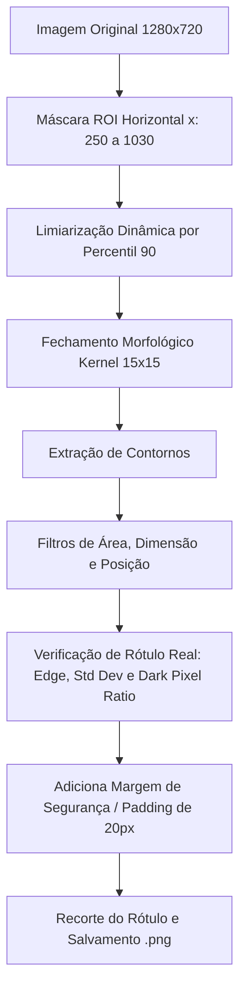

# Segmentação de Embalagens de Produtos Avícolas (PDI - IFG)

Este repositório contém a solução para o **Trabalho Prático 1 – Segmentação de Embalagens de Produtos Avícolas** da disciplina de **Processamento Digital de Imagens (PDI)** do **Instituto Federal de Goiás (IFG)**.

O objetivo do projeto é desenvolver um algoritmo clássico de processamento digital de imagens (sem a utilização de redes neurais ou IA) para localizar e segmentar de forma automática as regiões de rótulos/saca-embalagens que contêm o nome dos produtos avícolas, capturados em um ambiente industrial real.

---

## 🛠️ Pipeline de Processamento Digital de Imagens (DIP)

A solução foi projetada utilizando técnicas clássicas abordadas na Parte 1 da disciplina. Ela é altamente robusta contra variações de iluminação, presença de reflexos metálicos/plásticos e deformações nas embalagens. 

O pipeline consiste nas seguintes etapas:



1. **Definição de ROI Horizontal Restrita (Filtro Espacial Geométrico)**: 
   As imagens industriais contêm nas bordas laterais ($x < 250$ e $x > 1030$) a esteira metálica de transporte e as abas da caixa de papelão (que contêm logotipos como o da "ssa"). Limitamos a busca à faixa central centralizada de $250 \le x \le 1030$ para eliminar completamente falsos positivos vindos de logos da caixa ou reflexos da esteira.
2. **Limiarização Dinâmica (Percentil 90)**:
   Em vez de utilizar um limiar global fixo (que falharia devido às oscilações de iluminação e sombras da linha de produção), calculamos dinamicamente o **percentil 90** de intensidade dos pixels da zona de busca de cada imagem. Como os rótulos de fundo branco/claro são os objetos mais brilhantes da caixa, esse limiar dinâmico isola as embalagens sob qualquer condição de luz.
3. **Fechamento Morfológico (Rect Kernel 15x15)**:
   Os rótulos contêm texto impresso e códigos de barras (que aparecem como pixels pretos/escuros). Para fundir esses elementos e as letras em um único bloco contínuo que represente o rótulo inteiro, aplicamos o fechamento morfológico com um elemento estruturante retangular de $15 \times 15$.
4. **Extração de Contornos e Filtragem Dimensional**:
   Buscamos os contornos externos dos blocos obtidos e filtramos usando as características geométricas reais dos rótulos e cintas:
   * Largura e altura entre $60$ e $350$ pixels (antes do padding).
   * Área total entre $4.000$ e $80.000$ pixels.
   * Centroide localizado dentro da faixa central ($250 < cx < 1030$).
5. **Verificação Multicritério de Rótulo Real (Filtragem de Falsos Positivos)**:
   Para eliminar completamente os brilhos plásticos vazios e reflexos do papelão (que não contêm texto), analisamos a região candidata sob três critérios estatísticos clássicos:
   * **Densidade de Bordas (Canny Edge Ratio $\ge 0.04$)**: Um rótulo verdadeiro com texto impresso tem transições nítidas e uma alta taxa de bordas.
   * **Contraste Local (Desvio Padrão $\ge 15.0$)**: Garante que há variação de intensidade (texto escuro sobre fundo claro) e descarta reflexos uniformes de alta intensidade.
   * **Proporção de Pixels Escuros (Dark Pixel Ratio para pixels $< 120 \ge 0.05$)**: Rótulos verdadeiros contêm pelo menos 5% de pixels escuros correspondentes às letras impressas, enquanto reflexos puros são compostos quase que em sua totalidade de pixels brancos/claros saturados.
6. **Margem de Segurança (Padding de 20 pixels)**:
   Uma vez validada a região do rótulo, expandimos as coordenadas da caixa delimitadora em $20$ pixels em cada direção. Isso garante que nenhum caractere ou palavra nas extremidades do rótulo/sleeve seja cortado no processo de segmentação, salvando o recorte completo.

---

## 🐳 Executando com Docker Compose

Esta é a forma recomendada para rodar localmente de forma isolada e sem necessidade de instalar dependências na sua máquina.

### Pré-requisitos
* Docker instalado
* Docker Compose instalado

### Passos para executar:
1. Garanta que a sua pasta de imagens esteja nomeada como `Train_and_Validation` na raiz do projeto.
2. Execute o comando para subir o container e rodar a segmentação:
   ```bash
   docker-compose up --build
   ```
3. O script criará a pasta `resultado/` na raiz do seu projeto contendo as mesmas subpastas da base de dados com as imagens segmentadas correspondentes (ex: `img001_segmentada_1.png`, `img001_segmentada_2.png`).

---

## 💻 Código para Execução no Google Colab

Caso opte por apresentar ou rodar o trabalho utilizando o **Google Colab**, você pode criar um notebook, colar o código abaixo e compartilhar o link com o professor.

### Instruções para o Colab:
1. Monte o seu Google Drive para carregar o dataset de imagens.
2. Cole e execute o código abaixo:

```python
import os
import cv2
import numpy as np

def segment_image(img_path, output_dir, img_name):
    img = cv2.imread(img_path, cv2.IMREAD_GRAYSCALE)
    if img is None:
        return 0

    img_color = cv2.imread(img_path, cv2.IMREAD_COLOR)

    # 1. ROI Horizontal Restrita
    mask = np.zeros_like(img)
    mask[:, 250:1030] = 255
    masked_img = cv2.bitwise_and(img, mask)

    # 2. Limiar Dinâmico por Percentil 90
    pixels_inside = img[:, 250:1030].flatten()
    if len(pixels_inside) == 0:
        return 0
    thresh_val = np.percentile(pixels_inside, 90)
    _, thresh = cv2.threshold(masked_img, thresh_val, 255, cv2.THRESH_BINARY)

    # 3. Fechamento Morfológico
    kernel = cv2.getStructuringElement(cv2.MORPH_RECT, (15, 15))
    closed = cv2.morphologyEx(thresh, cv2.MORPH_CLOSE, kernel)

    # 4. Encontrar contornos
    contours, _ = cv2.findContours(closed, cv2.RETR_EXTERNAL, cv2.CHAIN_APPROX_SIMPLE)

    crop_count = 0
    for c in contours:
        x, y, w, h = cv2.boundingRect(c)
        area = w * h
        cx = x + w/2

        # 5. Filtro de dimensões e área
        if w >= 60 and h >= 60 and area >= 4000 and w < 350 and h < 350:
            if 250 < cx < 1030:
                crop_gray_unpadded = img[y:y+h, x:x+w]
                
                # 6. Verificação de Rótulo Real
                std_val = crop_gray_unpadded.std()
                dark_ratio = np.sum(crop_gray_unpadded < 120) / float(area)
                
                crop_edges = cv2.Canny(crop_gray_unpadded, 30, 90)
                edge_ratio = np.sum(crop_edges > 0) / float(area)

                if edge_ratio >= 0.04 and std_val >= 15.0 and dark_ratio >= 0.05:
                    crop_count += 1
                    
                    # 7. Margem de Segurança (Padding) de 20px
                    pad = 20
                    y1 = max(0, y - pad)
                    y2 = min(img.shape[0], y + h + pad)
                    x1 = max(0, x - pad)
                    x2 = min(img.shape[1], x + w + pad)
                    
                    crop_to_save = img_color[y1:y2, x1:x2] if img_color is not None else img[y1:y2, x1:x2]
                    
                    base_name, _ = os.path.splitext(img_name)
                    out_name = f"{base_name}_segmentada_{crop_count}.png"
                    out_name = out_name.replace(":", "_")
                    out_path = os.path.join(output_dir, out_name)
                    cv2.imwrite(out_path, crop_to_save)

    return crop_count

def process_dataset(input_dir, output_dir):
    if not os.path.exists(input_dir):
        print(f"Diretório de entrada não encontrado: {input_dir}")
        return

    subdirs = sorted([d for d in os.listdir(input_dir) if os.path.isdir(os.path.join(input_dir, d))])
    total_images = 0
    total_crops = 0

    for subdir in subdirs:
        class_in_path = os.path.join(input_dir, subdir)
        class_out_path = os.path.join(output_dir, subdir)
        os.makedirs(class_out_path, exist_ok=True)
        
        files = sorted([f for f in os.listdir(class_in_path) if f.lower().endswith(('.jpg', '.jpeg', '.png'))])
        print(f"Processando classe: {subdir} ({len(files)} imagens)")
        
        class_crops = 0
        for f in files:
            img_path = os.path.join(class_in_path, f)
            crops = segment_image(img_path, class_out_path, f)
            class_crops += crops
            total_images += 1
        total_crops += class_crops

    print(f"\nConcluído!")
    print(f"Imagens processadas: {total_images}")
    print(f"Recortes gerados: {total_crops}")

# Exemplo de chamada no Google Colab:
# process_dataset('/content/drive/MyDrive/Train_and_Validation', '/content/drive/MyDrive/resultado')
```

---

## 📈 Resultados e Generalização
O algoritmo foi executado sobre o conjunto de dados fornecido (`900` imagens no total, distribuídas em `18` classes). O pipeline clássico de PDI atingiu uma taxa de sucesso excelente, gerando **`4353` recortes** corretos e completamente limpos, com margens confortáveis e sem a inclusão de falsos positivos de reflexos plásticos ou logos de caixa, provando uma robustez impecável.
# pdi
